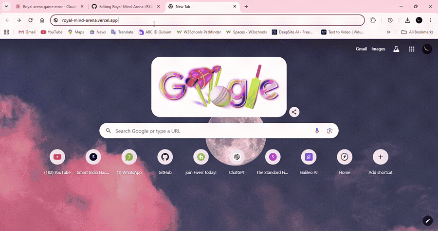
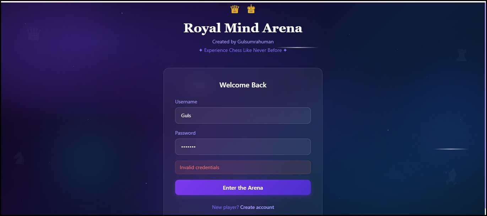
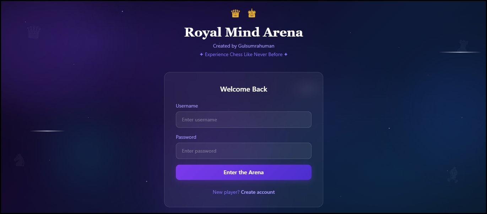
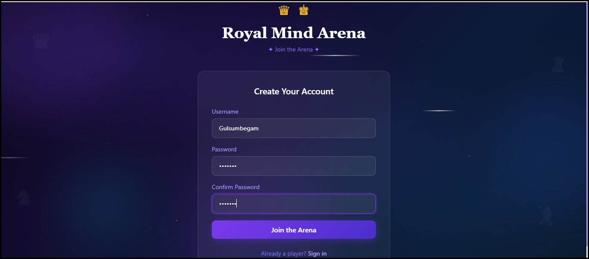
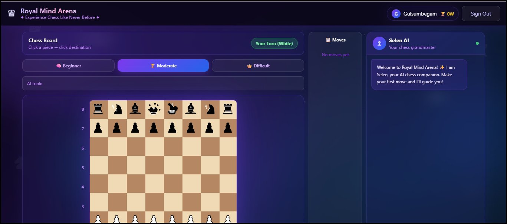
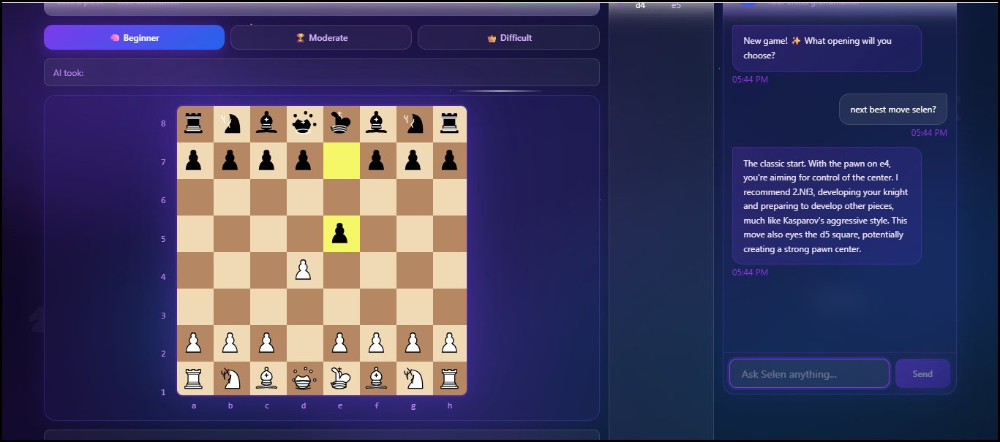
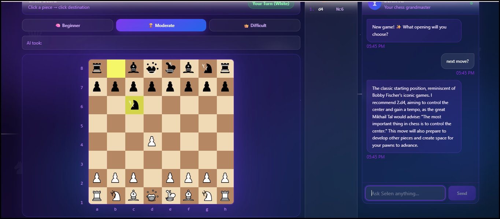
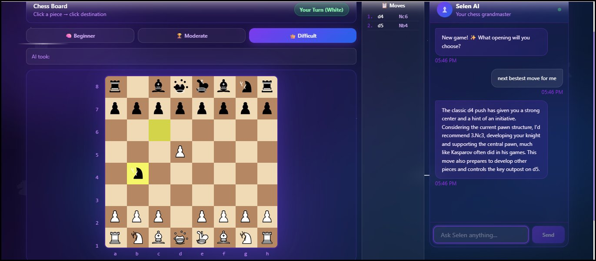
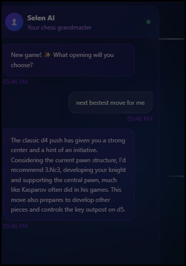
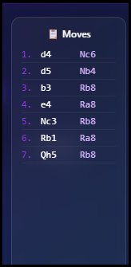

<div align="center">


<br/>


<br/><br/>

> **A full-stack AI-powered chess platform with Selen — your personal grandmaster AI companion**

<br/>

[](https://royal-mind-arena.vercel.app)
[](https://github.com/GulsumBegam/Royal-Mind-Arena-)
[](https://github.com/GulsumBegam/Royal-Mind-Arena-/issues)

</div>

---

## 🎬 Demo

<div align="center">



*Full gameplay — chess board, AI moves, Selen coaching, move history*

</div>

---

## 📸 Screenshots

<div align="center">

### 🔐 Authentication

<table>
  <tr>
    <td align="center"><b>✍️ Create Account</b></td>
    <td align="center"><b>🔑 Sign In</b></td>
  </tr>
  <tr>
    <td></td>
    <td></td>
  </tr>
  <tr>
    <td align="center" colspan="2"><b>⚠️ Invalid Login Handling</b></td>
  </tr>
  <tr>
    <td align="center" colspan="2"></td>
  </tr>
</table>

### ♟️ The Arena

<table>
  <tr>
    <td align="center"><b>🆕 Fresh Game — Choose Your Difficulty</b></td>
    <td align="center"><b>🧩 Beginner Mode in Action</b></td>
  </tr>
  <tr>
    <td></td>
    <td></td>
  </tr>
  <tr>
    <td align="center"><b>🏆 Moderate Mode — Minimax at Work</b></td>
    <td align="center"><b>👑 Difficult Mode — Full Challenge</b></td>
  </tr>
  <tr>
    <td></td>
    <td></td>
  </tr>
</table>

### 💬 Selen — Your AI Grandmaster

<table>
  <tr>
    <td align="center"><b>🧠 Selen Coaching in Real Time</b></td>
    <td align="center"><b>📋 Move History Panel</b></td>
  </tr>
  <tr>
    <td></td>
    <td></td>
  </tr>
</table>

</div>

---

## ✨ What is Royal Mind Arena?

**Royal Mind Arena** is a full-stack chess application built with cutting-edge web technologies. It combines a complete chess engine with an adaptive AI opponent and **Selen** — an intelligent AI chess companion powered by Meta's LLaMA 3.3 70B model via Groq. Whether you're a complete beginner or a seasoned player, Royal Mind Arena adapts to your skill level and helps you grow through real-time coaching and position analysis.

---

## 🎯 Features

### ♟️ Complete Chess Engine
- Full rule implementation — castling, en passant, pawn promotion, check, checkmate, stalemate, and draw detection
- Professional SVG chess pieces with smooth rendering
- Visual move highlighting — selected piece, legal destinations, last move indicators
- Sound effects for every action — move, capture, check, and game over
- Captured pieces tracker for both sides

### 🤖 Adaptive AI Opponent

| Difficulty | Algorithm | Ideal For |
|-----------|-----------|-----------|
| 🧩 **Beginner** | Random moves with capture preference | Newcomers learning the basics |
| 🏆 **Moderate** | Minimax (depth 2) + Alpha-Beta pruning | Intermediate players |
| 👑 **Difficult** | Minimax (depth 3) + Advanced evaluation | Experienced players seeking a challenge |

### 💬 Selen — Your AI Chess Grandmaster

> *"The most unique feature of Royal Mind Arena"*

Selen is a real AI chess coach powered by **Meta LLaMA 3.3 70B** via **Groq API**. She isn't a simple chatbot — she is a grandmaster-level companion who:

- 🎓 **Teaches strategy** — openings, middlegame plans, and endgame technique
- 🔍 **Reads your position** — the actual board FEN is sent with every message so she always knows where every piece is
- 📚 **Cites chess history** — references Kasparov, Bobby Fischer, Magnus Carlsen, and Mikhail Tal
- 🗣️ **Speaks chess fluently** — uses terms like tempo, initiative, outpost, pawn structure, and zugzwang
- 💪 **Coaches in real-time** — celebrates strong moves and gently guides you past mistakes
- 🤝 **Auto-analyzes** — comments on your position every few moves without being asked

#### Selen's Architecture

```
Player sends message
        ↓
Next.js API Route (/api/chat)
        ↓
Groq API  →  Meta LLaMA 3.3 70B
        ↓
System prompt: "You are Selen, an elite grandmaster AI companion..."
Current board FEN injected into context
        ↓
Grandmaster-level response generated
        ↓
Displayed in the chat panel
```

### 📋 Move History
- Complete game notation in **standard algebraic notation**
- Scrollable, numbered move list with both sides displayed
- Persistent across the session

### 📊 Player Stats
- Track wins, losses, and draws
- Win rate percentage with visual progress indicator
- Total moves played stored in the database

### 🔐 Secure Authentication
- Register and login with username and password
- Passwords secured with **PBKDF2** (Node.js native crypto, 12 rounds)
- Sessions stored in **HTTP-only cookies** with 7-day expiry
- Protected routes — the game is only accessible when authenticated

---

## 🛠️ Tech Stack

| Layer | Technology | Purpose |
|-------|-----------|---------|
| **Framework** | Next.js 15 (App Router) | Full-stack React framework |
| **Language** | TypeScript | Type-safe development |
| **Styling** | Tailwind CSS | Utility-first styling |
| **Chess Logic** | chess.js | Move validation & game rules |
| **AI Companion** | Groq API + LLaMA 3.3 70B | Selen's intelligence |
| **Database** | Neon PostgreSQL (Serverless) | User & game data storage |
| **ORM** | Drizzle ORM | Type-safe database queries |
| **Auth** | Native Crypto (PBKDF2) + HTTP-only cookies | Secure sessions |
| **Deployment** | Vercel | Serverless hosting |

---

## 🏗️ Project Structure

```
royal-mind-arena/
├── app/
│   ├── api/
│   │   ├── auth/
│   │   │   ├── login/route.ts        # Login endpoint
│   │   │   ├── register/route.ts     # Registration endpoint
│   │   │   └── logout/route.ts       # Logout endpoint
│   │   ├── chat/route.ts             # Selen AI endpoint (Groq)
│   │   └── game/route.ts             # Chess AI move endpoint
│   ├── game/page.tsx                 # Main game page
│   ├── login/page.tsx                # Login page
│   ├── register/page.tsx             # Register page
│   ├── layout.tsx                    # Root layout + animated background
│   └── globals.css                   # Global styles + animations
├── components/
│   ├── GameClient.tsx                # Main chess game component
│   ├── ChessPiece.tsx                # SVG chess piece renderer
│   ├── LoginForm.tsx                 # Login form component
│   └── RegisterForm.tsx              # Registration form component
├── lib/
│   ├── db.ts                         # Neon database connection
│   ├── schema.ts                     # Drizzle schema definitions
│   ├── auth.ts                       # Authentication utilities
│   └── chess-ai.ts                   # Minimax AI engine
└── drizzle.config.ts                 # Drizzle ORM configuration
```

---

## 🚀 Getting Started

### Prerequisites
- **Node.js** 18 or higher
- A free [Neon](https://neon.tech) account
- A free [Groq](https://console.groq.com) account

### 1. Clone the repository
```bash
git clone https://github.com/GulsumBegam/Royal-Mind-Arena-.git
cd Royal-Mind-Arena-
```

### 2. Install dependencies
```bash
npm install
```

### 3. Configure environment variables
Create a `.env.local` file in the root directory:
```env
DATABASE_URL=postgresql://your-neon-connection-string
GROQ_API_KEY=gsk_your-groq-api-key
```

### 4. Push database schema to Neon
```bash
npx drizzle-kit push
```

### 5. Start the development server
```bash
npm run dev
```

Visit [http://localhost:3000](http://localhost:3000) — register an account and start playing! 🎉

---

## 🌐 Deploy Your Own

This app is production-ready and deploys in under 2 minutes on Vercel.

1. **Fork** this repository
2. Create a **Neon** database at [neon.tech](https://neon.tech) — copy the connection string
3. Get a free **Groq API key** at [console.groq.com](https://console.groq.com)
4. **Import** the repo on [Vercel](https://vercel.com)
5. Add environment variables in Vercel project settings:
   - `DATABASE_URL` → your Neon connection string
   - `GROQ_API_KEY` → your Groq API key
6. **Deploy** ✅

---

## 🧠 How the Chess AI Works

The AI opponent is built on the **Minimax algorithm with Alpha-Beta Pruning**:

```
For each candidate move:
  → Apply the move to a virtual board
  → Evaluate the resulting position (material count)
  → Recursively look ahead 2–3 moves deep
  → Choose the move that minimises the opponent's advantage
  → Alpha-beta pruning eliminates branches that can't improve the result
```

**Piece values used in position evaluation:**

| Piece | Points |
|-------|--------|
| ♙ Pawn | 100 |
| ♘ Knight | 320 |
| ♗ Bishop | 330 |
| ♖ Rook | 500 |
| ♕ Queen | 900 |
| ♔ King | 20,000 |

---

## 🎨 Design System

- **Animated background** — drifting glowing orbs, twinkling stars, and shooting stars built in pure CSS
- **Glass morphism** — frosted glass cards with backdrop blur throughout
- **Gradient accents** — purple-to-blue gradient text and glowing neon borders
- **Responsive layout** — fully functional on mobile, tablet, and desktop
- **Color palette** — deep navy backgrounds with royal purple and electric blue accents

---

## 👩‍💻 Author

<div align="center">

**Gulsumrahuman**

*"I built Royal Mind Arena to combine my love for chess with modern AI technology. Selen is the heart of this project — a real AI companion that makes chess accessible and enjoyable for everyone."*

<br/>

[](https://github.com/GulsumBegam)

</div>

---

## 📄 License

This project is licensed under the **MIT License** — you are free to use, modify, and distribute it.

---

<div align="center">

**If you enjoyed this project, please consider giving it a ⭐ — it truly means a lot!**

<br/>

*Made with ♟️ and 💜 by **Gulsumrahuman***

</div>
